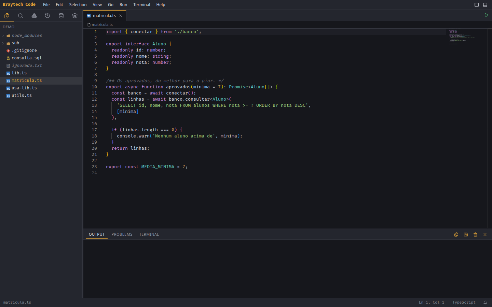
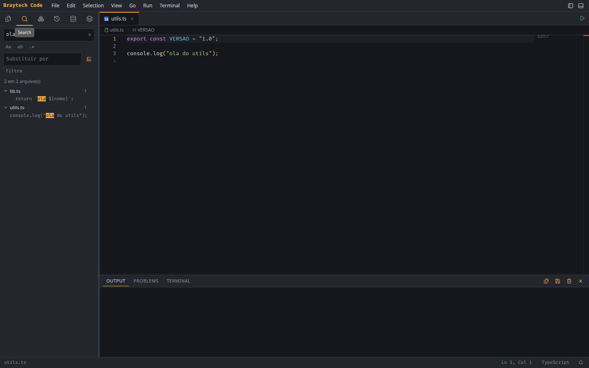
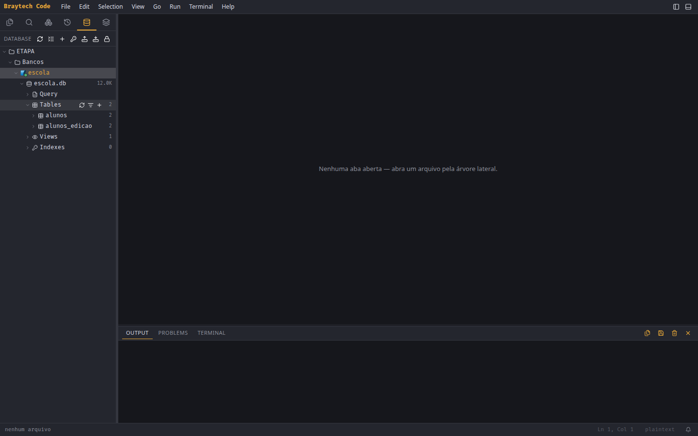
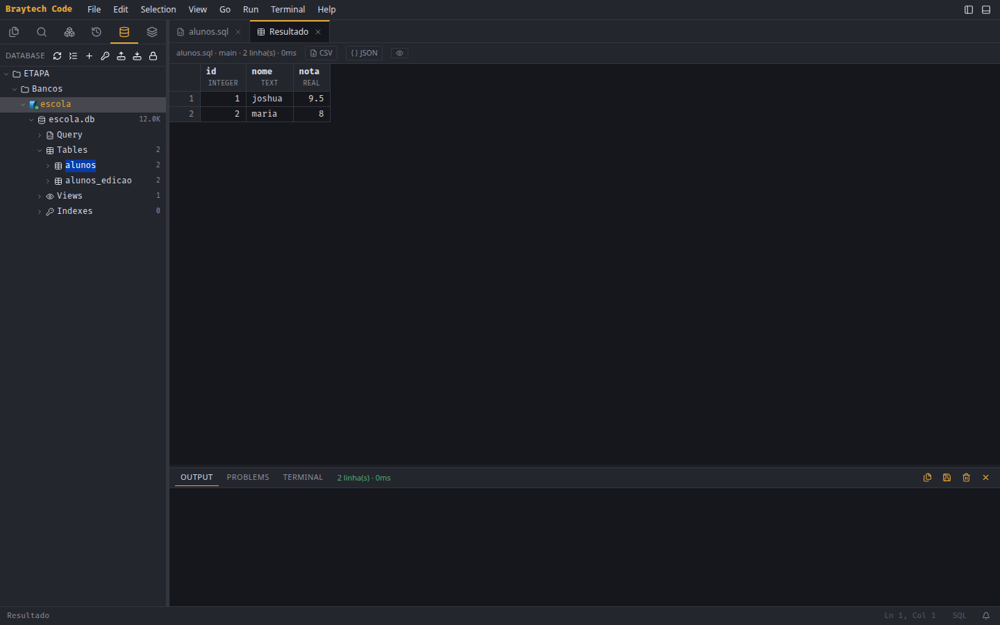
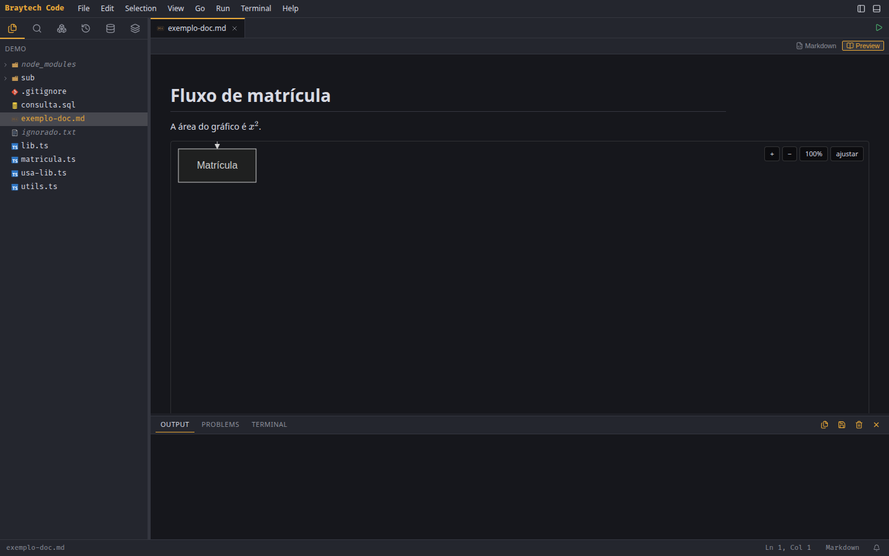
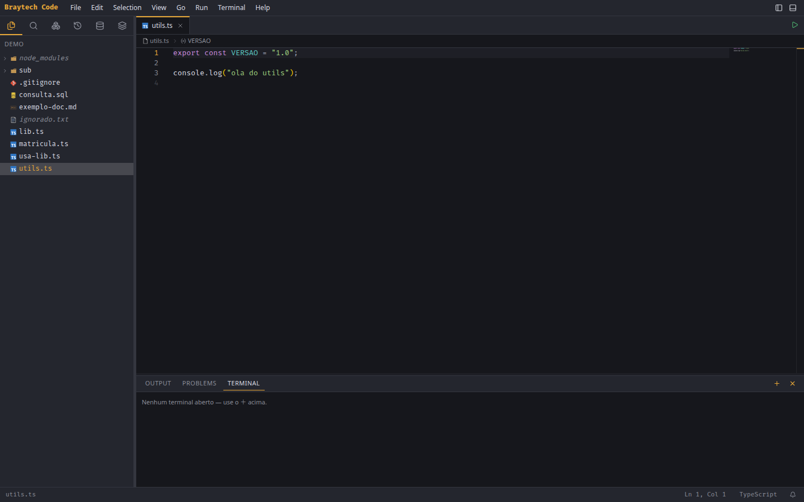

<div align="center">

# Braytech Code

**Uma IDE própria** — editor, bancos de dados, servidores remotos e terminal,
no navegador ou como aplicativo de desktop.

</div>



Nasceu para substituir uma extensão comercial de cliente de banco, e cresceu
para o que faltava em volta dela. É feita para um uso só — o de quem a
escreveu — e por isso cada decisão dela tem um dono e um porquê.

---

## Começar

```bash
npm install
npm start          # http://localhost:4321
```

Como aplicativo de desktop:

```bash
npm run instalar   # empacota e põe o ícone no menu do sistema
```

Os dois modos rodam **o mesmo servidor** e **a mesma interface**. O desktop
acrescenta o que o navegador não tem: diálogo nativo de pasta e chaveiro do
sistema para as senhas.

> **Linux:** o AppImage precisa de FUSE — sem ele, use o `.tar.gz`. E rodar a
> versão desktop a partir do código com o isolamento do Chromium ligado exige um
> `sudo` uma única vez; sem ele, `npm run electron:sem-sandbox`.
>
> **Windows** ainda não roda: há quatro pontos do código que assumem Unix, e
> estão listados em [`docs/tecnico.md`](docs/tecnico.md).

---

## O que ela faz

### Editar código

O editor é o Monaco, com diagnósticos, renomear símbolo em todos os arquivos,
`Ctrl+clique` para a definição, autocompletar e trilha de navegação.

Executa **JavaScript, TypeScript, Python, PHP, C, C# e shell** — o arquivo
inteiro, uma seleção ou uma função. E a saída vira **problemas clicáveis** que
levam ao arquivo e à linha:



A busca aceita expressão regular, respeita o `.gitignore` e substitui em todos
os arquivos de uma vez.

### Falar com bancos de dados

MySQL, PostgreSQL e SQLite. A árvore desce até a coluna, e o resultado abre numa
grade que **edita** — com chave primária, o `UPDATE` é montado para você
conferir antes.



Duplo clique numa tabela abre a consulta pronta; `Ctrl+Enter` executa:



Também há **diagrama ER** (do schema inteiro ou de uma tabela e seus vizinhos),
DDL, comparação de estrutura entre dois bancos, e SQL de usuário e permissão —
este último **gerado e copiado, nunca executado**.

> As senhas ficam num cofre cifrado. A IDE **nunca** devolve um segredo numa
> listagem: revelar é um pedido explícito, campo a campo.

### Escrever documentos e cadernos

Preview de markdown com **Mermaid** e **KaTeX**, além de imagem, PDF e CSV — este
editável pela própria grade:



E cadernos `.sqlbook`: blocos de SQL e markdown, com os resultados que você
escolher guardar.

### Terminal e servidores remotos

Terminais locais e remotos, divididos em painéis. SSH com salto por bastion,
SFTP, FTP, monitor de processos e download de pasta como zip.



> No terminal, **`Ctrl+Shift+C` copia** e **`Ctrl+Shift+V` cola** — o `Ctrl+C`
> continua sendo o `SIGINT`, que é o que se espera de um terminal. O menu de
> botão direito faz as duas coisas, para não depender de decorar o atalho.

### Não perder trabalho

Timeline de versões locais de cada arquivo, rascunho automático do que não foi
salvo, aviso ao fechar e histórico de notificações.

---

## Atalhos que vale conhecer

| Atalho | O quê |
|---|---|
| `Ctrl+Shift+P` | Paleta de comandos |
| `Ctrl+P` | Ir para arquivo |
| `Ctrl+Shift+O` | Ir para símbolo |
| `Ctrl+Enter` | Executar o arquivo, o bloco ou a consulta |
| `F2` | Renomear símbolo em todos os arquivos |
| `Ctrl+J` / `Ctrl+B` | Esconder o painel de baixo / a lateral |
| `Ctrl+Shift+C` | Copiar, dentro do terminal |

---

## Para quem vai mexer no código

- [`docs/tecnico.md`](docs/tecnico.md) — arquitetura, API REST, drivers, o cofre
  e o modelo de segurança.
- `specs/` — a fonte da verdade. Uma pasta por entrega, com as decisões
  numeradas e o **porquê** de cada uma, inclusive das recusadas.

```
1814 testes de unidade  ·  568 de ponta a ponta
```

Além dos de sempre, a suíte tem comparação de imagem, verificação de
acessibilidade e orçamento de peso e de tempo — e os três **provam que
funcionam**: há um teste que planta um defeito e cobra que o verificador o
encontre.

> Os prints desta página são gerados por `npm run prints`, contra o projeto de
> teste. Quando a interface muda, eles são refeitos — é o que impede a
> documentação de envelhecer sem ninguém perceber.

---

## Aviso

A IDE **executa código arbitrário** por design e **guarda credenciais**. O
servidor escuta só em `127.0.0.1` e recusa requisições de origem não-local. Use
em máquina de desenvolvimento, e não coloque um proxy reverso na frente dela.
